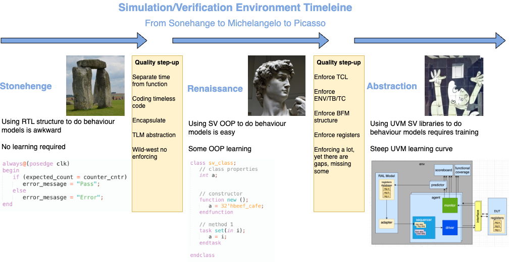
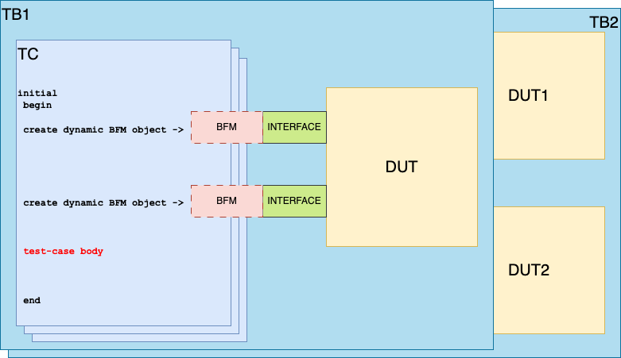
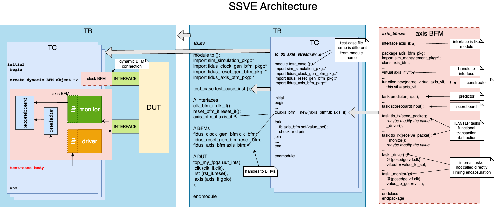
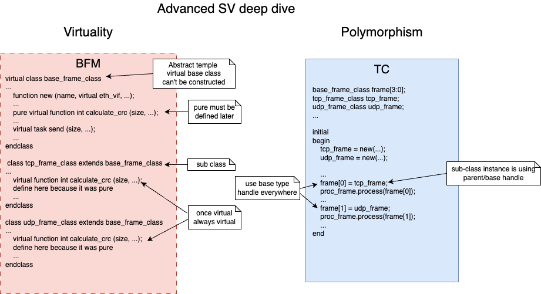

## 2. SystemVerilog Verification

^^GP

> SystemVerilog has become the **de facto standard for HDL simulation and verification**, 

However, the flexibility **SystemVerilog** offers has led to a wide variety of verification environments, often described as the "wild west" due to their lack of standardization. To bring order, the **Universal Verification Methodology (UVM)** was introduced by Accellera in 2011, building on earlier standards like OVM and VMM to unify testbench structures and enable interoperability across tools.

However, even with UVM’s structured class libraries, phasing, and factories, teams still develop significantly divergent implementations of their verification environments. In practice, each project ends up with its own flavour of UVM — verifying the necessity of UVM’s standardization even as its flexibility spawns new variations.

_Figure 5.10.1 - Simulation Environment Timeline. (Composite image. See Image Credits for details)_ [^figure5.10.1.1][^figure5.10.1.2][^figure5.10.1.3]

**The diagram above illustrates the progression and evolution of simulation and verification methodologies:**

**RTL structures** - the process relied on basic and rigid RTL approaches

* It is slow to implement
* Cumbersome to change

**SystemVerilog** - more advanced techniques emerged with the adoption of SystemVerilog, introducing:

- Object-oriented programming concepts
- Functions encapsulation
- Transaction-level protocol (TLP) abstraction
- Too much flexibility leads to chaos of implementations

**UVM (Universal Verification Methodology)** - the introduction of UVM  enforced greater standardization by:

- Formalizing TLP abstraction

- Formalizing test-bench structure and configurations

- Enforcing a standard implementation and functional separation for bus functional models (BFMs) as agents, scoreboards, checkers, functional coverage, etc.

- UVM still allows for significant variation in how simulation environments are implemented, for example - agent middle layers, predictors as part of scoreboard or separate, etc.

### 2.1 Verification Good Practices

Generic good verification practices

^^GP

> **_Verification good practices include:_**
>
> **_Single Test-Case features:_**
>
> **Simulation results** – Saved in special folders and a regression archive for organized tracking.
>
> **Message & Statistics collection library** – Centralized and standardized using a common library with pass/warning/fail functions, Provides overall pass/warning/fail/finished/unfinished status for all test cases.
>
> **Simulation library compilation** - it is possible to compile the libraries and add them to the simulator .ini file or to be linked dynamically with every test case run
>
> **EDA Tool TCL script processing** – Enables automated integration of Vivado/Quartus/etc. exported simulation scripts into the simulation environment as DUT.
>
> **Ready-to-use examples/templates** – Includes copy-and-paste scripts, configurations, and test cases for quick setup.
>
> **Nested TB/TC structure** – The folders and files structure supports multiple test-benches (TB) with multiple test-cases (TC) per TB
>
> **_Regression features:_**
>
> **Randomization** – A unique seed is generated for every new run, with the option to set a fresh random seed or fixed seed for debugging.
>
> **Regression** – Offers a rich, well-integrated suite of features for managing test suites and automated runs. If a regression run is interrupted, you can edit the regression list file in the regression folder and resume from where it left off.
>
> **Resume regressions** - If the regression was interrupted, after simple edit of the regression list file in the regression folder,  the regression can be resumed
>
> **Merged statistics reporting** – Consolidates pass/warning/fail/finished/unfinished status for all test cases.
>
> **Coverage merging** – Code coverage can be toggled for speed, centrally managed, with all statistics merged into a unified coverage database and report.
>
> **Per-run command-line options** – Allows enabling/disabling of coverage, testbench and RTL compilation, and forcing a random seed.
>
> **Multithreaded regression** – Supports concurrent runs where each new thread run consuming additional simulation licenses. This can greatly speedup regression.
>
> **History info** - all regression run final statistics are stored in the archived folder

### 2.2 Simple SV Simulation/Verification Environment (SSVE) and SIMU Framework for FPGA Design

^^GP

>  The SystemVerilog Simulation Environment methodology described in this chapter adopts a minimalistic approach, requiring only basic SystemVerilog knowledge for an FPGA RTL designer to begin creating simulation environments. It supports verification at the module, core, and full device levels of the FPGA.

**SIMU** is an open-source HDL simulation framework, initially developed by Fidus and released under both **MIT** and **Apache‑2.0** licenses. This framework is following the SSVE methodology.

- **Latest SSVE documentation**: Available on GitHub at [wolfy‑42/ssve‑documentation](https://github.com/wolfy-42/ssve-documentation).
- **Latest SIMU framwork documentation**: Available on GitHub at [wolfy‑42/simu‑documentation](https://github.com/wolfy-42/simu-documentation).
- **Latest SIMU framework code and example designs**: Available on GitHub at [wolfy‑42/simu‑symphony](https://github.com/wolfy-42/simu-symphony).

SIMU offers a wide range of advantages and only a few drawbacks:

**Pros**

- **Small learning curve**: Using Simple SystemVerilog constructs that FPGA designers can master creating their own BFMs, test-benches, and test-cases quickly with no previous training or practice.
- **Standard, widely used TCL**: Built on a common, industry-proven scripting language used by all HDL EDA tools.
- **Ready-made templates**: A few project-provided examples help accelerate setup and adoption.

**Cons**

- **Basic Object-Oriented SystemVerilog (OOP SV) learning required**: Basic training is covered in the sections below. Requires basic minimal OOP learning.

- **Advanced features deferred**: Deeper SystemVerilog constructs like transaction level models and protocols (TLM and TLP), and polymorphism can be learned later, at the user's pace.

  

The SIMU SSVE environment already supports all the features highlighted in  [5.10.1 Verification Good Practices](#5.10.1 Verification Good Practices). In addition, SIMU provides the following powerful capabilities.

^^GP

> **_Some Additional Simulation-Environment Features Supported by SIMU_**
>
> **_General Features:_**
>
> **HDL Languages** – Supports SystemVerilog, Verilog, VHDL, with HLS and UVM  support currently in development.
>
> **Simple and Flexible** – Easily switch between simulators on the fly. Provides a ready-to-use environment for the three main HDL languages. Supports full or partial compilation, code coverage, random or fixed seeds, and enabling/disabling test case groups. Regression test lists can be auto-generated or manually managed.
>
> **TCL-Based** – No new language to learn. Runs directly inside EDA tool TCL interpreters on Linux or Windows. A lightweight SIMU shell layer runs on top, with just a few config files required.
>
> **Multiple Testcases and Testbenches per Module** – Supports many test cases and multiple testbenches per module or top-level design. Groups can be selectively enabled or disabled.
>
> * **Nested folder structure** – The `/testcases/tc_module` layout supports multiple test cases in `tc_module` folders, multiple `tc_module` folders, and multiple `testcases` folders.
>
> **Single Testcase Execution** – Run any individual test case via CLI or GUI. Generates WLF files for debugging, using a personal `wave.do` file.
>
> **CLI run options** - it is possible to pass some arguments when running TC simulation
>
> **Messages and Statistics Library** – Centralized library for standardized pass/warning/fail messages. Aggregates statistics and generates reports per test case and regression session.
>
> **Reusable Templates** – Includes ready-made TB, TC, and BFM templates to quickly build from examples.
>
> **Scalable Complexity** – Start with simple designs and gradually adopt advanced SystemVerilog features like TLM and polymorphism when needed.
>
> **_Regression Features:_**
>
> **Regression Testing** – Run regression across all test cases for a module or across all modules. Regression lists can be created automatically or maintained manually. Includes archiving and multithreaded regression support.
>
> **Automatic test case execution** – Scans all test case folders and runs them automatically. A test case is identified when three conditions are met: it resides in a specific folder level, its filename starts with `tc_…`, and it has a `.tcl` extension.
>
> **Test case disable-list and enable-list** – Enables inclusion or exclusion of specific test cases from automatic regression.
>
> **CLI run options** - it is possible to pass some arguments when running regression simulation
>
> **Coverage Handling** – Supports code coverage generation and aggregation of coverage results across regression runs.
>
> **Structured Configuration** - in three locations
>
> * A few environment/global configuration TCL scripts - located in the top-level folder named ...config... 
>
> * A few test case specific configuration TCL scripts - located in the same folder as the test case
>
> * Regression resume config - the file holding the list of test cases being run/status have to be edited to remove the interrupted test case lock label
>
> **History tracking** – Archives all final statistics from regression runs in an archived folder for future reference.

Also SIMU has several BFMs that are quite helpful and free to use, listed below:

**Clock and Reset BFMs** - Fidus

**AXI-Lite Master BFM** - Fidus

**AXI-Stream Video/Checker BFMs** – Fidus

**AXI-Lite/AXI-Full/AXI-Stream BFMs** – Xilinx/AMD

**AXI-Lite/AXI-Full/AXI-Stream BFMs** – OSVVM

**I2C BFMs** – Fidus

**Ethernet TPG BFMs** - Fidus

The SystemVerilog methodology described in this chapter adopts a minimalistic approach, requiring only basic knowledge for an FPGA RTL designer to begin creating simulation environments. It supports verification at the module, core, and full device levels of the FPGA.

_Figure 50.10.2.1-1 SV Test-Bench Hierarchy with TC at the top_ 

_Figure 50.10.2.1-2 SV Test-Bench Hierarchy with TB at the top_ (used by SIMU SSVE examples)

Two recommended options for the SystemVerilog testbench (TB) hierarchy are shown above. At the top level is either a test-case module or a testbench module. **These two structures are quite similar and neither is inherently better or wors**e than the other, with theirs pros and cons. Fundamentally, both include instances of several key components: the test-bench module, the test-case module, the DUT (Design Under Test), and the required interface instances.

**The test-case (TC)** consists of a single `initial` process, which begins with the creation of dynamic BFM objects. This is followed by the main body of the test case, where a sequence of events is generated to exercise the required functionality.

**Multiple test-benches** can be seen In both configurations - on the diagrams above one test-bench contains a single DUT and another with two DUTs. Each test-bench can be driven by several test-cases (TCs). 

**The DUT (Design Under Test)** is the module intended for simulation and is instantiated within the testbench module.

**The SystemVerilog BFMs** are used exclusively to interface the DUT, with no other stimulus sources used. However, it is acceptable to drive some DUT ports with constant values.

**SIMU examples** use the hierarchy with the test-bench (TB) at the top level.

### 2.2.1 Simple SV Simulation/Verification Environment (SSVE)

**Latest SSVE documentation**: Available on GitHub at [wolfy‑42/ssve‑documentation](https://github.com/wolfy-42/ssve-documentation)

The SystemVerilog methodology described in this chapter adopts a minimalistic approach, requiring only basic knowledge for an FPGA RTL designer to begin creating simulation environments. It supports verification at the module, core, and full device levels of the FPGA.

TODO add diagram

### 2.2.2 SIMU Framework

**SIMU** is an open-source HDL simulation framework, initially developed by Fidus and released under both **MIT** and **Apache‑2.0** licenses.

- **Latest SIMU framework documentation**: Available on GitHub at [wolfy‑42/simu‑documentation](https://github.com/wolfy-42/simu-documentation).

- **Latest SIMU framework code and example designs**: Available on GitHub at [wolfy‑42/simu‑symphony](https://github.com/wolfy-42/simu-symphony).

  

### 2.3 Verification Levels

#### 2.3.1 Module-Level Simulation

^^GP

> Each module should have its own dedicated test-benches, as well as corresponding sets of test-cases written in SystemVerilog. In this case it is recommended to use the Simple SystemVerilog Verification Environment based in SIMU. Using UVM for module-level verification is discouraged due to its significant overhead and the fact that RTL designers, who are typically responsible for module-level verification, often lack the necessary UVM expertise.

TODO use simu GitHub refrences and slides ref 

**Latest SIMU framework code and example designs**: Available on GitHub at [wolfy‑42/simu‑symphony](https://github.com/wolfy-42/simu-symphony).

#### 2.3.2 Core-Level Simulation

^^GP

The core-level simulation environement  should have its own test-benches and sets of test-cases written in SystemVerilog, especially when this task is handled by the RTL designer. Using UVM is also a valid option if a dedicated UVM verification engineer is available. Even in this case, it's still beneficial for RTL designers to create a lighter SystemVerilog-based environment, as the goals of the RTL and UVM verification teams are slightly different.

TODO use simu GitHub refrences and slides ref 

**Latest SIMU framework code and example designs**: Available on GitHub at [wolfy‑42/simu‑symphony](https://github.com/wolfy-42/simu-symphony).

#### 2.3.3 Top-Level Simulation

^^GP

The device-level, also called top-level simulation environemnt should have its own test-benches and sets of test-cases written in SystemVerilog, especially when this task is handled by the RTL designer. Using UVM is also a valid option if a dedicated UVM verification engineer is available. Even in this case, it's still beneficial for RTL designers to create a lighter SystemVerilog-based environment, as the goals of the RTL and UVM verification teams are slightly different.

TODO use simu GitHub refrences and slides ref 

**Latest SIMU framework code and example designs**: Available on GitHub at [wolfy‑42/simu‑symphony](https://github.com/wolfy-42/simu-symphony).

<h4 style="text-align: center;">***</h4>

