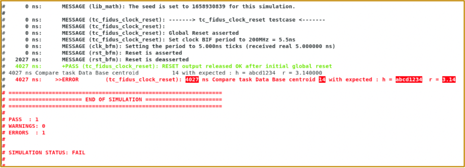

# 5. FPGA Implementation

This section will follow to some extend the structure of the design specification document, aligning its organization and content with the corresponding  sections. 

In telecommunications, there is a key architectural concept of dividing system functionality into two distinct planes: the **control plane** and the **data plane**.

1. **Control Plane**
   The control plane typically originates from a central processing unit (CPU) — either a hard or soft CPU — and is responsible for managing the system's configuration and monitoring. It provides access to Control, Configuration, and Status Registers (CSR), which are used to configure various modules and IP blocks, as well as to monitor their operational status and performance.
2. **Data Plane**
   The data plane is responsible for the main data processing tasks. It operates independently of the control plane during normal operation, as it typically does not require continuous monitoring or frequent configuration changes. Once the data traffic flow is established, the data plane can function autonomously, enabling high-throughput and low-latency processing.

In general, an FPGA design operates in one of two modes:

1. **Mission Mode**
   In this mode, the FPGA performs its primary functionality as intended by the design. It executes the core logic and processes real operational data in a production or deployment environment.

2. **Diagnostic Mode**
   This mode is used for testing and validation purposes. The FPGA generates test traffic and checks the integrity of received data to identify performance issues or to verify the functionality of external hardware components. 

   * **HW Test Image**
   
     In some cases, diagnostic mode may be implemented as a separate FPGA design image specifically tailored for hardware verification tasks — such as validating pinout connectivity, signal integrity, or interface performance.
   


## 5.1 Overview

   TODO top level diagram showing top/core/modules with control and data plane


**The diagram above illustrates a typical structure of an FPGA RTL design, consisting of the following layers:**

1. **Chip Top-Level Module**
   This module includes the device I/O and vendor-specific interface IPs such as TGx, HDMI/DP, PCIe, Ethernet PHY, MMCM, PLL, or other similar IP blocks with complex physical protocols. These IPs are typically dependent on the specific FPGA part number and are often resource-heavy and time-consuming to simulate. Placing them in the top-level module enables flexibility in targeting different boards or commercial off-the-shelf (COTS) evaluation platforms, without impacting the core processing logic. This modularity allows for easy replacement of the top-level when compiling for different hardware, while maintaining a consistent core logic design underneath.
2. **Core Module**
   This module contains the main data processing logic. It interfaces with the top-level using high-level protocols such as AXI-Stream or AXI-MM, and deliberately avoids complex physical interfaces like Ethernet PHYs. This abstraction allows for faster, more efficient simulation by focusing on functional behavior at the protocol level, without the overhead of simulating low-level physical protocol details. All functional blocks, including the control plane manager (which can be a hard or soft CPU), are instantiated at this level.
3. **Lower-Level Modules**
   These are the building blocks of the core module and perform specific control plane or data plane functions. They represent the smallest modular elements of the design, contributing to the overall functionality of the system.


## 5.2 Functions Description

### 5.1.1 Function1

TODO describe function 1


### 5.1.1 Function2

TODO describe function 2


## 5.3 External Interfaces

TODO add RTL generated diagram and table


### 5.3.1 External Clocks and Resets

TODO give example of external clocks and resets to pins


TODO diagram of clock domains


TODO diagram of resets distribution


### 5.3.2 Other External Interfaces

TODO give another interface example as I2C


   

## 5.4 Chip Top Module

This module handles device I/O and vendor-specific interface IPs (e.g., TGx, HDMI/DP, PCIe, Ethernet PHY, MMCM, PLLs), which are resource-intensive and board-dependent. Placing them at the top level allows easy adaptation to different hardware platforms while keeping the core logic unchanged.

^^GP

> Use SV interfaces or VHDL records to pass big interfaces like AXI-MM or AXI-Lite as a single port

^^GP

> Define all top level and core level VS interfaces/VHDL records in only one common package and only once.

^^GP

> Create a wrapper for each of the IPs to be instantiated here and use SV interfaces or records to connect them to the core module. This approach promotes modularity and clean integration within the overall FPGA architecture.

^^GP

> "It is also recommended to instantiate here MMCMs or PLLs, encapsulated within a module, to generate derived clocks and resets from the incoming external clocks and resets. If a different board with a different input reference clock is used, only this module needs to be modified to accommodate the change. This approach allows you to maintain multiple top-level modules, each dedicated to a specific evaluation board."


TODO add a diagram showing top level


TODO add top module vs code with the interfaces package code - top ports code, core instance ports, IP instances in SV wrappers with SV interfaces


TODO add top module diagram autogenerated TermsHDL


TODO add top module ports table autogenerated with TerosHDL


TODO state that all modules description below also should start with the outogen 


## 5.5 Core Module

This module handles main data processing and connects to the IPs instantiated in the top level via high-level protocols like AXI-Stream or AXI-MM, avoiding complex  physical interfaces. This abstraction enables faster, more efficient simulation by focusing on protocol-level functionality, with all key blocks—including the control plane manager — instantiated here.


TODO add a diagram showing core level with: port to top, with CPU instance, AXI-Lite interconnect, Control plane connection to different modules (sv and vhdl), 


TODO add code sv&VHDL covering the above diagram


## 5.6 Other Modules

The main modules of an FPGA design can be grouped into several categories:

- IPI or Platform Designer (PD) designs used to integrate vendor IPs
- Clock and reset generation and distribution
- Control plane for CSR, which can either be integrated  within the data processing modules or implemented as a separate instance at the core level
- Data processing functions, where the primary FPGA functionality is implemented
- Diagnostic modules for testing purposes


### 5.6.1 Clocks 

TODO diagram for sources and generation example from external clock and resets


TODO diagram for sources and generation from internal source


TODO diagram clock domains 


### 5.6.2 Resets

1. Deriving clk by a chain of x2 PLL is not good for jitter, show data sheet numbers
2. Internal clock source is not accurate or stable


TODO diagram resets distribution


TODO diagram resets timing using wavedrom


### 5.6.2 IPI/Platform Designer

When to use IPI/PD and when not


#### 5.6.2.1 Hard/Soft CPU in IPI (or as RTL)

Why put CPU in IPI - because of all resets and interconnects and other hi speed IP direct data flow


^^GP

> A good practice is to place your hard or soft CPU instance in the IPI(BD) or Platform Designer (PD). This approach makes the CPU firstly the source of key clocks and resets, secondly establishes it as the manager of the control plane via AXI interconnects, and finally it simplifies the integration of additional IP blocks with their various interfaces.


TODO diagram

1. Provide clocks show clocks generation and clock domains diagram

2. Provide resets show resets sequencing and timing

3. Provide CSR plane show the distribution of it

   


### 5.6.3 FF structure

examples with explanations

```systemverilog
wire [1:0] signal;
```

TODO add code for FF without rest (to be used for LUT RAM or routing FF in Altera), FF with async reset (to be avoided), FF with sync reset (verily and vhdl) (the recommended FF structure for FPGA)


TODO add a shift register code, and 2xD shift reg (verily & vhdl)


TODO add pulse generation code


TODO add a counter code (x2)


   

### 5.6.4 Functional State Machine (FSM) 4+

TODO add diagram and explanation - self recovery, watchdog, priority/err states, fsm used counters, inputs products, output products


TODO add couple of code examples


TODO add ref to IEEE papers to make this statement strong


### 5.6.5 CDC


TODO theory explanation - not simple - don't design form scratch

What is MTBF


TODO use slide ref


list CDC types example library


## 5.7 Remote Upgrade

TODO describe few options 


TODO add few diagrams for the options


## 5.8 Diagnostic features

^^ GP

> **The minimum set of diagnostic features typically includes:**
> - Insert ILA in RTL
> - Transmit (TX) and receive (RX) packet counters for both successful and errored packets
> - Test Pattern Generators and Checkers (TPG/CH)
> - Watchdog trigger counters
> - FSM (Finite State Machine) error state counters

**Diagnostic features can be classified as either non-invasive or invasive, based on their impact on normal system operation:**

1. **Non-Invasive Diagnostics**
   These features monitor system behavior without disrupting functionality. They include:
   - Packet receive and transmit counters
   - Counters for successfully received packets and received with errors packets
   - Watchdogs timeout counters
   - FSM (Finite State Machine) error state counters designed for graceful fault handling
   - FSM state logging for operational insight and debugging
   - Bus monitors, like AXI-MM and AXIS bus monitor IPs
   - Embedded logic analyzers like ILA/SignalTap
   - SerDes eye monitoring
   - Link monitoring
2. **Invasive Diagnostics**
   These features actively influence the system and may temporarily affect normal operation. They include:s
   - Test Pattern Generators and Checkers (TPG/CH) for injecting and validating test traffic
   - Independent module resets controlled via Control and Status Registers (CSR)
   - Build in self test (BIST) functionality
   - Loopbacks
   - Bypass
   - Traffic recording and replay
   - Isolation of faulty module for graceful degradation


TODO add diagram showing TPG/CH, FSM err counters, packet counters

### 5.8.1 ILA insertion in RTL

^^GP

> It is recommended to insert the ILA directly in the RTL at the core or module level, using a parameter to control whether it is synthesized.  This approach makes it clear which signals are connected to each ILA port, simplifying debug and signal tracing. The main drawback is that the RTL will include the ILA instance as a diagnostic feature, which can add some clutter to the code.


TODO add diagram showing ILA at core level or module level


TODO add code showing ILA with ports for bits width of 1,4,8,16,32


## 5.9 Control Plane CSR RDL

TODO diagram of control plane 


TODO unified header


### 5.9.1 Interrupts Hierarchy

TODO add diagram of interrupt hierarchy


TODO use references for RDL 

1. Top level rdl code
2. Module level rdl code
3. Registers types code - all major types, counters wrap or saturate, write1 to clear
4. Interrupts registers code
5. Memory pass through with BRAM shim


TODO diagram show Module level ports nesting


### 5.9.2 SRDL Generated HDL

TODO show examples

### 5.9.2 SRDL Generated SW headers

TODO show examples

### 5.9.2 SRDL Generated Documentation

TODO show examples


## 5.10 SystemVerilog Verification

^^GP

> SystemVerilog has become the **de facto standard for HDL simulation and verification**, 

However, the flexibility **SystemVerilog** offers has led to a wide variety of verification environments, often described as the "wild west" due to their lack of standardization. To bring order, the **Universal Verification Methodology (UVM)** was introduced by Accellera in 2011, building on earlier standards like OVM and VMM to unify testbench structures and enable interoperability across tools.

However, even with UVM’s structured class libraries, phasing, and factories, teams still develop significantly divergent implementations of their verification environments. In practice, each project ends up with its own flavour of UVM — verifying the necessity of UVM’s standardization even as its flexibility spawns new variations.


_Figure 5.10.1 - Simulation Environment Timeline. (Composite image. See Image Credits for details)_ [^figure5.10.1.1][^figure5.10.1.2][^figure5.10.1.3]

**The diagram above illustrates the progression and evolution of simulation and verification methodologies:**

**RTL structures** - the process relied on basic and rigid RTL approaches

* It is slow to implement
* Cumbersome to change

**SystemVerilog** - more advanced techniques emerged with the adoption of SystemVerilog, introducing:

- Object-oriented programming concepts
- Functions encapsulation
- Transaction-level protocol (TLP) abstraction
- Too much flexibility leads to chaos of implementations

**UVM (Universal Verification Methodology)** - the introduction of UVM  enforced greater standardization by:

- Formalizing TLP abstraction

- Formalizing test-bench structure and configurations

- Enforcing a standard implementation and functional separation for bus functional models (BFMs) as agents, scoreboards, checkers, functional coverage, etc.

- UVM still allows for significant variation in how simulation environments are implemented, for example - agent middle layers, predictors as part of scoreboard or separate, etc.


### 5.10.1 Verification Good Practices

Generic good verification practices

^^GP

> **_Verification good practices include:_**
>
> **_Single Test-Case features:_**
>
> **Simulation results** – Saved in special folders and a regression archive for organized tracking.
>
> **Message & Statistics collection library** – Centralized and standardized using a common library with pass/warning/fail functions, Provides overall pass/warning/fail/finished/unfinished status for all test cases.
>
> **Simulation library compilation** - it is possible to compile the libraries and add them to the simulator .ini file or to be linked dynamically with every test case run
>
> **EDA Tool TCL script processing** – Enables automated integration of Vivado/Quartus/etc. exported simulation scripts into the simulation environment as DUT.
>
> **Ready-to-use examples/templates** – Includes copy-and-paste scripts, configurations, and test cases for quick setup.
>
> **Nested TB/TC structure** – The folders and files structure supports multiple test-benches (TB) with multiple test-cases (TC) per TB
>
> **_Regression features:_**
>
> **Randomization** – A unique seed is generated for every new run, with the option to set a fresh random seed or fixed seed for debugging.
>
> **Regression** – Offers a rich, well-integrated suite of features for managing test suites and automated runs. If a regression run is interrupted, you can edit the regression list file in the regression folder and resume from where it left off.
>
> **Resume regressions** - If the regression was interrupted, after simple edit of the regression list file in the regression folder,  the regression can be resumed
>
> **Merged statistics reporting** – Consolidates pass/warning/fail/finished/unfinished status for all test cases.
>
> **Coverage merging** – Code coverage can be toggled for speed, centrally managed, with all statistics merged into a unified coverage database and report.
>
> **Per-run command-line options** – Allows enabling/disabling of coverage, testbench and RTL compilation, and forcing a random seed.
>
> **Multithreaded regression** – Supports concurrent runs where each new thread run consuming additional simulation licenses. This can greatly speedup regression.
>
> **History info** - all regression run final statistics are stored in the archived folder


### 5.10.1.1 Simple SV Simulation/Verification Environment (SSVE) for FPGA Design

^^GP

>  The SystemVerilog Simulation Environment methodology described in this chapter adopts a minimalistic approach, requiring only basic SystemVerilog knowledge for an FPGA RTL designer to begin creating simulation environments. It supports verification at the module, core, and full device levels of the FPGA.

**SIMU** is an open-source HDL simulation framework, initially developed by Fidus and released under both **MIT** and **Apache‑2.0** licenses.

- **Latest SIMU framework code**: Available on GitHub at [wolfy‑42/simu‑symphony](https://github.com/wolfy-42/simu-symphony).

- **Latest SIMU documentation**: Available on GitHub at [wolfy‑42/simu‑documentation](https://github.com/wolfy-42/simu-documentation).

  

SIMU offers a wide range of advantages and only a few drawbacks:

**Pros**

- **Small learning curve**: Using Simple SystemVerilog constructs that FPGA designers can master creating their own BFMs, test-benches, and test-cases quickly with no previous training or practice.
- **Standard, widely used TCL**: Built on a common, industry-proven scripting language used by all HDL EDA tools.
- **Ready-made templates**: A few project-provided examples help accelerate setup and adoption.

**Cons**

- **Basic Object-Oriented SystemVerilog (OOP SV) learning required**: Basic training is covered in the sections below. Requires basic minimal OOP learning.

- **Advanced features deferred**: Deeper SystemVerilog constructs like transaction level models and protocols (TLM and TLP), and polymorphism can be learned later, at the user's pace.

  

The SIMU SSVE environment already supports all the features highlighted in  [5.10.1 Verification Good Practices](#5.10.1 Verification Good Practices). In addition, SIMU provides the following powerful capabilities.

^^GP

> **_Some Additional Simulation-Environment Features Supported by SIMU_**
>
> **_General Features:_**
>
> **HDL Languages** – Supports SystemVerilog, Verilog, VHDL, with HLS and UVM  support currently in development.
>
> **Simple and Flexible** – Easily switch between simulators on the fly. Provides a ready-to-use environment for the three main HDL languages. Supports full or partial compilation, code coverage, random or fixed seeds, and enabling/disabling test case groups. Regression test lists can be auto-generated or manually managed.
>
> **TCL-Based** – No new language to learn. Runs directly inside EDA tool TCL interpreters on Linux or Windows. A lightweight SIMU shell layer runs on top, with just a few config files required.
>
> **Multiple Testcases and Testbenches per Module** – Supports many test cases and multiple testbenches per module or top-level design. Groups can be selectively enabled or disabled.
>
> * **Nested folder structure** – The `/testcases/tc_module` layout supports multiple test cases in `tc_module` folders, multiple `tc_module` folders, and multiple `testcases` folders.
>
> **Single Testcase Execution** – Run any individual test case via CLI or GUI. Generates WLF files for debugging, using a personal `wave.do` file.
>
> **CLI run options** - it is possible to pass some arguments when running TC simulation
>
> **Messages and Statistics Library** – Centralized library for standardized pass/warning/fail messages. Aggregates statistics and generates reports per test case and regression session.
>
> **Reusable Templates** – Includes ready-made TB, TC, and BFM templates to quickly build from examples.
>
> **Scalable Complexity** – Start with simple designs and gradually adopt advanced SystemVerilog features like TLM and polymorphism when needed.
>
> **_Regression Features:_**
>
> **Regression Testing** – Run regression across all test cases for a module or across all modules. Regression lists can be created automatically or maintained manually. Includes archiving and multithreaded regression support.
>
> **Automatic test case execution** – Scans all test case folders and runs them automatically. A test case is identified when three conditions are met: it resides in a specific folder level, its filename starts with `tc_…`, and it has a `.tcl` extension.
>
> **Test case disable-list and enable-list** – Enables inclusion or exclusion of specific test cases from automatic regression.
>
> **CLI run options** - it is possible to pass some arguments when running regression simulation
>
> **Coverage Handling** – Supports code coverage generation and aggregation of coverage results across regression runs.
>
> **Structured Configuration** - in three locations
>
> * A few environment/global configuration TCL scripts - located in the top-level folder named ...config... 
>
> * A few test case specific configuration TCL scripts - located in the same folder as the test case
>
> * Regression resume config - the file holding the list of test cases being run/status have to be edited to remove the interrupted test case lock label
>
> **History tracking** – Archives all final statistics from regression runs in an archived folder for future reference.


Also SIMU has several BFMs that are quite helpful and free to use, listed below:

**Clock and Reset BFMs** - Fidus

**AXI-Lite Master BFM** - Fidus

**AXI-Stream Video/Checker BFMs** – Fidus

**AXI-Lite/AXI-Full/AXI-Stream BFMs** – Xilinx/AMD

**AXI-Lite/AXI-Full/AXI-Stream BFMs** – OSVVM

**I2C BFMs** – Fidus

**Ethernet TPG BFMs** - Fidus


The SystemVerilog methodology described in this chapter adopts a minimalistic approach, requiring only basic knowledge for an FPGA RTL designer to begin creating simulation environments. It supports verification at the module, core, and full device levels of the FPGA.


_Figure 50.10.2.1-1 SV Test-Bench Hierarchy with TC at the top_ 


_Figure 50.10.2.1-2 SV Test-Bench Hierarchy with TB at the top_ (used by SIMU SSVE examples)

Two recommended options for the SystemVerilog testbench (TB) hierarchy are shown above. At the top level is either a test-case module or a testbench module. **These two structures are quite similar and neither is inherently better or wors**e than the other, with theirs pros and cons. Fundamentally, both include instances of several key components: the test-bench module, the test-case module, the DUT (Design Under Test), and the required interface instances.

**The test-case (TC)** consists of a single `initial` process, which begins with the creation of dynamic BFM objects. This is followed by the main body of the test case, where a sequence of events is generated to exercise the required functionality.

**Multiple test-benches** can be seen In both configurations - on the diagrams above one test-bench contains a single DUT and another with two DUTs. Each test-bench can be driven by several test-cases (TCs). 

**The DUT (Design Under Test)** is the module intended for simulation and is instantiated within the testbench module.

**The SystemVerilog BFMs** are used exclusively to interface the DUT, with no other stimulus sources used. However, it is acceptable to drive some DUT ports with constant values.

**SIMU examples** use the hierarchy with the test-bench (TB) at the top level.





### 5.10.2 Verification Levels


#### 5.10.2.1 Module-Level Simulation

^^GP

> Each module should have its own dedicated test-benches, as well as corresponding sets of test-cases written in SystemVerilog. In this case it is recommended to use the Simple SystemVerilog Verification Environment based in SIMU. Using UVM for module-level verification is discouraged due to its significant overhead and the fact that RTL designers, who are typically responsible for module-level verification, often lack the necessary UVM expertise.


#### 5.10.2.2 Core-Level Simulation

^^GP

The core-level simulation environement  should have its own test-benches and sets of test-cases written in SystemVerilog, especially when this task is handled by the RTL designer. Using UVM is also a valid option if a dedicated UVM verification engineer is available. Even in this case, it's still beneficial for RTL designers to create a lighter SystemVerilog-based environment, as the goals of the RTL and UVM verification teams are slightly different.


#### 5.10.2.1 Top-Level Simulation

^^GP

The device-level, also called top-level simulation environemnt should have its own test-benches and sets of test-cases written in SystemVerilog, especially when this task is handled by the RTL designer. Using UVM is also a valid option if a dedicated UVM verification engineer is available. Even in this case, it's still beneficial for RTL designers to create a lighter SystemVerilog-based environment, as the goals of the RTL and UVM verification teams are slightly different.


TODO use simu GitHub refrences and slides ref


### 5.10.3 UVM

Not defined - agent middle layers, predictors as part of scoreboard or separate, etc.


TBD is the functional coverage from monitor or from scoreboard

## 5.11 Partial Reconfiguration


## 5.12 Design protection


TODO add brief description about below

1. Using FPGA uniques ID - DNA

2. Using external unique ID chips with 1-wire interface

3. Use several ring oscillators, one generates clock, the other generates data - giving a PRBS ID that differs by the LSBs only so MSB can be used as a uniques die fingerprint


## 5.13 Reliability, Redundancy and Single Upset Event (SUE)

TODO high level mention the effect and typical solutions by Xilinx or generic

1. Triple redundancy
2. CPU lock step
3. Fuse fpga and live config CRC and update


## 5.14 SW for FPGA design


### 5.14.1 Baremetal SW

TODO basic baremetal SW example to rd/wr and check registers


TODO example of bare-metal driver functions

### 5.14.2 Linux SW

TODO linux major components - fsbl/?, kernel, file system ram/flash, hard/soft CPU


TODO linux drivers


## 5.15 Third party synthesis

### 5.15.1 HLS

High-Level Synthesis (HLS) is supported by AMD/Xilinx, Altera (Intel), and Siemens/Mentor. 

^^GP

> High-Level Synthesis (HLS) is supported by AMD/Xilinx, Altera (Intel), and Siemens/Mentor. The AMD/Xilinx solution stands out for its exceptional integration with AXI-Stream (AXIS) and AXI Memory-Mapped (AXI-MM) interfaces, making it the preferred choice for HLS design due to its seamless workflow and robust support for data movement and interconnect standards.


TODO minimum HLS examples with AXIS or AXI-MM bursts


#### 5.15.1.1 HLS Verification

The AMD/Xilinx VitisHLS tool provides an integrated development environment (IDE) with a user-friendly GUI, streamlining HLS and C++ development  for both RTL design and C++ testbench simulation. This unified platform supports efficient workflow management, design analysis, synthesis, PaR and STA.

It should be noted that HLS simulation is significantly faster than RTL simulation — often by several orders of magnitude — which makes it a preferred environment for simulation-heavy workloads such as video  processing.

^^GP

> The intuitive HLS GUI from AMD/Xilinx, its tight integration with AXI-MM and AXIS interfaces, and the extremely fast simulation times make HLS a preferred solution for certain applications, especially those requiring rapid design iterations and efficient and quick design modifications.


TODO show simu for HLS example, note it is raw


### 5.15.2 MatLab

MATLAB offers two main approaches for generating HDL code:

**Simulink Based Generation:**
Using Simulink, you can leverage FPGA vendors extensive IP libraries and tight integration with their PaR tools to design, simulate, and generate HDL code, enabling pre- and post-synthesis simulation and seamless integration of the generated IP core with the final design.

**MATLAB Code Generation:**
You can write your design directly in MATLAB code and use HDL Coder to generate vendor-independent HDL, making it suitable for any FPGA — even  those without dedicated MATLAB integration — offering a more universal  solution.

#### 5.14.2.1 Simulink

TODO minimum MatLab examples


#### 5.14.2.2 Codegen

TODO minimum MatLab examples


#### 5.14.2.3 MatLab verification


TODO mention simu can do Matlab simulation regressions, note it is theoretically possible, bit not implemented yet


## 5.15 Synthesis, PaR, STA

### 5.15.1 Constraints

TODO add code for all 10 main constraints from references


### 5.15.2 Synthesis

It is possible to insert an Integrated Logic Analyzer (ILA) during the  synthesis process if the signals of interest are marked for debug in the RTL. This approach is widely used, but as the design grows, the number of  debug-marked signals can increase significantly. After synthesis, some signal names may change, making it uncertain whether the selected signals to monitor are correct or, at times, making them difficult to locate during debugging.

Also, during the synthesis flow, signals that need to be connected to the ILA  must be assigned using a Tcl script, adding an extra step to the  compilation process. This requirement can slightly increase complexity, as it involves manual signal assignment and script management during synthesis.

^^GP

> It is preferable to insert the ILA directly in the RTL and use a debug  parameter to control whether it is synthesized or not. This approach makes it easier to manage and locate debug signals, and you can find an example in the RTL section.

#### 5.15.2.1 Third party synthesis

^^GP

> Always use the synthesis tool and flow provided by the FPGA vendor, as these tools deliver the best resource optimization, device support, and  integration with the latest features. This ensures optimal performance, efficient implementation, and reliable support throughout your development process.

An alternative to the FPGA vendor’s synthesis tool is Synopsys Synplify, which is a highly regarded synthesis tool in the industry. Some vendors, such as Lattice, even use a dedicated version of Synplify as their primary synthesis tool, integrating it directly into their toolsets for optimized FPGA support.

### 5.15.3 PaR

Location placement - limit logic placement by module in a specific SLR

TODO add diagram

TODO give code example


SLR crossing - need to add primitive(give example), or add generic x7 FF with/without? reset

TODO add diagram

TODO give code exaple


DFX RTL rules - use the same interface, assert resets when reconfigure the module, define area on die (or maybe not anymore like Altera), list the required handling of the interfaces

TODO add diagram showing that


### 5.15.4 STA

^^GP

> When timing fails and negative slack is reported, it is crucial to address the root cause, as the failing path shown is often not the true source of the timing issue. In such cases, it is recommended to remove all constraints and rebuild them from scratch, following a systematic approach as outlined in the Xilinx design methodology, and listed below. This helps ensure that constraints are correctly defined and that the underlying issues are discovered and addressed.

TODO for below use references


Timing fail path very often is not the reason, the reason is somewhere else

Design to fix thing:

Fix all constraints in this order:

1, remove all constraints, add only clocks and async groups

2, 3, 4 

5. remove async groups

Add pipeline to signals

Add multi-cycle paths


## 5.16 Formal Verification


### 5.16.1 CDC


### 5.16.2 Assertions


## 5.18 Third Party IPs Used

List of IPs with configurations they are used in


## 5.17 Size and Power Estimations

pins/FF/LUT/RAM/IP

Power rails and current


## 5.18 Device External Electrical Interfaces

Device pinout 

Test interfaces

JTAG connector


I2C interface

TODO drawings of connectors and AC timing of interfaces


### 5.19 Device Physical Interfaces

FPGA package

Operating ranges

Heatsinks


<h4 style="text-align: center;">***</h4>


